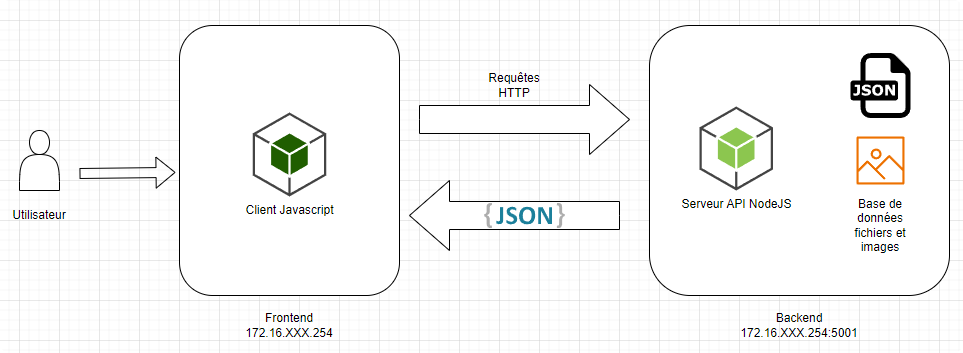
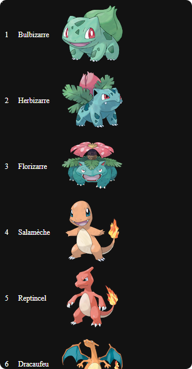
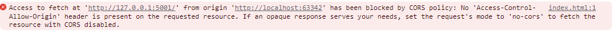

```
  ____       _                                   _    ____ ___ 
 |  _ \ ___ | | _____ _ __ ___   ___  _ __      / \  |  _ \_ _|
 | |_) / _ \| |/ / _ \ '_ ` _ \ / _ \| '_ \    / _ \ | |_) | | 
 |  __/ (_) |   <  __/ | | | | | (_) | | | |  / ___ \|  __/| | 
 |_|   \___/|_|\_\___|_| |_| |_|\___/|_| |_| /_/   \_\_|  |___|
```

# Serveur Backend en Node JS

## Arborescence

Tous les fichiers du serveur backend sont dans le dossier **BACKEND**.

Les dossiers **DATA** et **FILES** sont à récupérer sur le NAS.

```
BACKEND
├── DATA
│   ├── items.json
│   ├── moves.json
│   ├── pokedex.json
│   └── types.json
├── FILES
│   ├── images
│   ├── sprites
│   └── thumbnails
├── index.js
└── README.md
``` 

## Objectifs

- Découverte de Node JS
- Comprendre le principe des API

# Mise en place

- Création d'un **dépôt git local sur WSL**
```bash
git init .
```

- Installation de Node, npm et des dépendances

```bash
sudo apt install nodejs npm -y
# Dépendances
npm install express
```

- Installation de **nodemon** pour avoir un node qui se relance à chaque modification du fichier
```bash
npm install -g nodemon
```

> Il peut être nécessaire de réaliser cette commande en **sudo**

# Création du script du serveur

On crée un fichier serveur nommé *index.js*.

Contenu de base:
```js
/**
 *  Serveur Backend Pokedex
 */

//console.log ("Hello World!");

// Définir l'emplacement des fichiers bases de données
const POKEDEX_SRC = "./DATA/pokedex.json";

// Définir l'emplacement des images
const IMAGES_SRC = "./FILES/images";


// Définir un port
const PORT = 5001;

// ************************************************

// Lancer un serveur express sur un port défini

const fs = require('fs');

// npm install express
const express = require('express');
const app = express();

// Lancement du serveur et attendre
app.listen(
    PORT, 
    '127.0.0.1', 
    () => {
        console.log('Server Pokedex is listening on ' + PORT);
    }
)
```


Pour le lancer, tapez:

```bash
node index.js

# Pour lancer plutôt en monitoring
nodemon index.js
```

---

# Routes à créer

> https://expressjs.com/en/guide/routing.html

## / (Pour tout afficher)

## /hasard (pour renvoyer un pokemon au hasard)

Algorithme:

1. Création de la route /hasard
2. Lecture du fichier _pokedex.json_
3. Définition d'un numéro au hasard compris entre le minimum et le maximum
    1. Quel est l'id minimum?
    2. Quel est l'id maximum?
        1. Quelle est la taille du pokedex?
4. Renvoi du pokemon ayant l'id **hasard**

- https://www.w3schools.com/js/js_random.asp

---

## /pokemon/ + un identifiant en paramètre (pour renvoyer un pokemon à partir d'un identifiant, si le pokemon correspondant existe)

## /pokemon/ + un nom (pour renvoyer un pokemon à partir d'un nom, si le pokemon correspondant existe)

## Servir les images des pokemons

> https://expressjs.com/en/starter/static-files.html

Cette route va renvoyer l'image du pokemon à partir de son identifiant.

Exemple, pour le pokemon ayant l'id 1, l'url sera http://localhost:5001/images/001.png


---

# Ce qu'il faudra faire ultérieurement

- Création du dépôt distant GitHub
- Clonage du dépôt distant sur la VM
- Réaliser la partie frontend
- Faire en sorte que les routes renvoient également les images liées aux pokemons

---

# Bonus

- Ajouter les liens vers les images des pokemons

- Créer une route qui renvoie les types de pokemons
- Créer une route qui renvoie les attaques de pokemons
- Créer une route qui renvoie les objets de pokemons

---

# Frontend



Vous trouverez un début de frontend dans le dossier **FRONT**.



> Vous allez très certainement rencontrer des problèmes de CORS.


> https://developer.mozilla.org/fr/docs/Web/HTTP/CORS

Pour y remédier, vous pouvez installer une extension sur votre navigateur pour désactiver la sécurité CORS.
Sinon, on va voir comment le faire en Node JS.

```js
const express = require('express');
const cors = require('cors')
const app = express();

// CORS
app.use(cors())
// Express va servir les fichiers statiques placés dans le dossier FILES
app.use(express.static('FILES'))
```

---

## Copyright Notice

Please note everything in repository are copyrighted by the Pokémon Company and its affiliates.
This repository is merely a compilation of data collected by the editors of [Bulbapedia](https://bulbapedia.bulbagarden.net/wiki/Main_Page).
